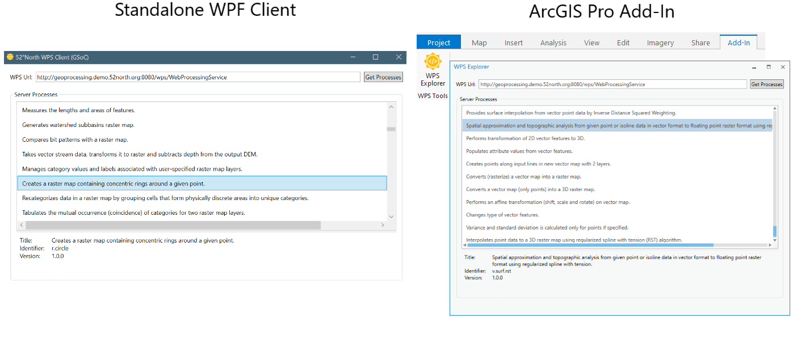

    
    <h2><b>52°North Challenge (2019)</b></h2>

    ⫦
    <a href="#description">Description</a>
    -
    <a href="#description">Preview</a>
    -
    <a href="#description">License</a>
    ⫣

## Description

This project was created within the Google Summer of Code 2019 global program and it has been primarily designed to complete the `Code Challenge` required by the [**52°North**](https://52north.org/) organization.

This client is quite simple in its design, being built entirely on the MVVM architectural pattern to allow quick robustesse and scalability to potential changes.

Providing a WPS server url to the client, it will fetch all the process summaries and will display them in a list, allowing the user to select each process to get slightly more detailed data about it. This implementation is only done with the `GetCapabilities` function.

The client is still lacking some of the functionalities of the WPS Standard such as the `DescribeProcess` function or the `Execute` function. It is although not required by the organization challenge and will not be implemented any sooner to stay within the bounds required by the organization.

## Preview

    

## License

MIT License